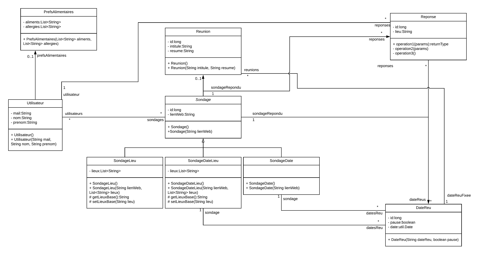

# Doodle Back, Hélène Heinlé et Emile Georget, M1 MIAGE, groupe 1B

## Contexte
L'objectif de ce projet était de créer une application permettant de réaliser des sondages afin d'organiser des réunions entre plusieurs participants. Ce fonctionnement est inspiré de la plateforme existante "Doodle".
Ce dépôt Git correspond au back end de l'application. ([front end](https://github.com/Equilat/DoodleFront))

## Base de données et entités JPA
Nous avons commencé par lister les éléments importants d'une application telle que Doodle. C'est ainsi que nous sommes arrivés au diagramme de classe suivant :

Nous sommes ensuite passés au développement en traduisant les classes précédentes en entités JPA. Voici le diagramme de la base de données :

Pour mettre en place la notion de sondage de lieu, de date et de date et lieu, nous avons opté pour de l'héritage. Pour implémenter cela en JPA, nous avons choisi la méthode Single Table. Ainsi, nous n'avons qu'une seule table "Sondage" en base et les types de données insérées (sondage date/lieu/date et lieu) sont distinguées par la colonne discriminatrice "dtype".

## API REST
La partie Back-end présentée ici, devait permettre, au final, de fournir une liste de méthodes interrogeant la base de données et donc de servir d'API. Dans le fichier de description "web.xml", on retrouve le répertoire contenant les classes d'API et aussi l'url qu'il faudra pointer pour y accéder. Nous avons mis comme url "/api/".

### Services
Dans le but de faire l'API, nous avons implémenté des services.

Nous avons préféré mettre en place un service par entité dans l'ensemble. Ainsi, le service concernant l'entité Utilisateur peut être accessible sur l'url http://localhost:8080/api/user, "user" étant le chemin d'accès attribué au service (@Path). Les méthodes utilitaires contenues dans ce service ont elles aussi un chemin d'accès. Dans la decription de ces méthodes, il y a aussi le type de requête HTTP accepté (@GET, @POST, @DELETE, @PUT). Ainsi, pour lister tous les utilisateurs, il faudrait interroger l'url http://localhost:8080/api/user/all à l'aide d'une requête HTTP GET.

### Data Access Objects (DAO)
Afin de moduler l'application, nous avons créé des classes DAO. Ces classes sont celles qui ont accès à la base de données et qui peuvent effectuer les opérations CRUD sur celle-ci à l'aide de requêtes JPQL.

Les services ne requêtent pas la base directement mais font appel à des DAO. Pour finir l'exemple précédent, la méthode pointée par l'url http://localhost:8080/api/user/all, appelle une métode du DAO qui s'occupe de la table Utilisateur.

## Point d'avancement
A ce jour, le back est complété avec toutes les entités décrites dans le diagramme de classe ci-dessus. Cependant, il manque l'opération de suppression dans les services suite au problème décrit dans les issues du dépôt.

